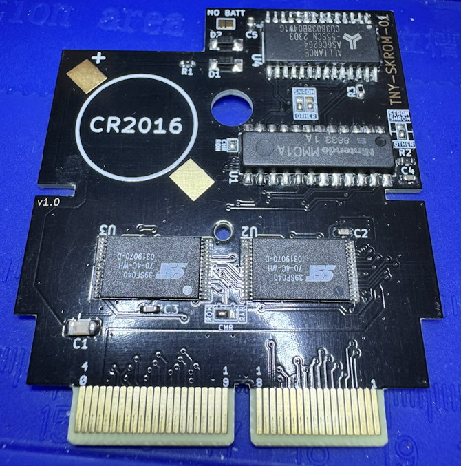

# TNY-SKROM

This is a custom SKROM board for the TinyTendo handheld console by <a href="https://github.com/Redherring32">Redherring32</a>. This board replicates <a href="https://www.nesdev.org/wiki/MMC1">standard SKROM NES boards</a>. SKROM uses CHR ROM and PRG RAM, and can have a backup battery if the game saves data on the PRG RAM. You can also make SLROM games with this board and remove the PRG RAM.

To use this board, you must remove an MMC1 mapper from an original NES board, clip the leads flush to the package, sand it, and mount it where U1 is indicated. Since these boards use the 39SF040 for both PRG and CHR ROM, you should use FamiROM or some other utility to duplicate the ROM files to completely fill up the entire space on the Flash chip if necessary.

# TNY-SKROM Board Characteristics

- Thickness: 1.6 mm
- Surface Finish: ENIG
- Chamfered edges (45°)
- Compatible NES board types: SAROM, SBROM, SCROM, SEROM, SFROM, SHROM, SIROM, SJROM, **SKROM**, SLROM
- Compatible NES board types with CHR RAM flex: SGROM, SMROM, SNROM, SUROM

# How to Use This Board

*Note: Do not solder U2 and U3 to the board before programming them.*

SAROM and SKROM games require every component on the board. **DO NOT** solder bridge the pads labelled "NO BATT."

SJROM games are the same as SAROM/SKROM, but without the battery, R1, D1, and D2. You must also bridge the two pads labelled "NO BATT" with solder.

SAROM, SBROM, SCROM, SEROM, SFROM, SHROM, and SLROM games are the same as SJROM, but without U4, R2, R4, C5, and C6. You don't need to bridge the "NO BATT" pads.

SGROM, SMROM, SNROM, and SUROM games require the included flex to fit an SRAM chip in place of the CHR ROM.

The solder jumpers must be bridged according to the NES board type you are trying to replicate.

| Jumper  | SA/SB/SC/SF/SI/SJ/SK/SL | SE/SH  | SG/SM/SU  | SN |
|:-------------------------------------:|:-------------------------------------:|:-------------------------------------:|:-------------------------------------:|:-------------------------------------:|
| CHR ROM  |  |   | Unbridged  | Unbridged  |
| CHR ROM/RAM  |  |   |   |   |
| SNROM  |  |   |   |   |
| SEROM/SHROM  |  |   |   |   |

## Flashing the Game

Prepare the ROM using FamiROM or other similar program, ensuring the entire 4Mbit space is filled for both the PRG and CHR components. You then need to program the 39SF040s before soldering them to the board. I use a <a href="https://www.embeddedcomputers.net/products/FlashcatUSB_XPORT/">FlashCat</a> with a <a href="https://www.embeddedcomputers.net/products/ParallelAdapters/">TSOP-32 adapter (Type B)</a> to achieve this.

# Bill of Materials

Capacitors should be at least 16V rated. Resistor wattage is negligible.

| Reference Designator  | Part Number/Value | Footprint  |
| ------------- | ------------- | ------------- |
| B1  | CR2016 | CR2016  |
| C1  | 22 uF | 1206  |
| C2-C5  | 0.1 uF | 0603  |
| D1, D2  | <a href="https://www.mouser.com/ProductDetail/Vishay-Semiconductors/BAT54W-HG3-18?qs=BJlw7L4Cy79w8lzctLBe5g%3D%3D">BAT54</a> | SMA (SOD-123) |
| R1  | 1 kΩ | 0603  |
| R2  | 27 kΩ | 0603  |
| R3  | 10 kΩ | 0603  |
| U1  | MMC1  | SHRINKDIP24  |
| U2  | <a href="https://www.mouser.com/ProductDetail/Microchip-Technology/SST39SF040-70-4C-WHE?qs=Oo69DRhzroe%2FJKrgAmUE5Q%3D%3D">39SF040</a>  | TSOP32 (14mm) |
| U3 (ROM)  | <a href="https://www.mouser.com/ProductDetail/Microchip-Technology/SST39SF040-70-4C-WHE?qs=Oo69DRhzroe%2FJKrgAmUE5Q%3D%3D">39SF040</a>  | TSOP32 (14mm) |
| U3 (RAM)  | <a href="https://www.mouser.com/ProductDetail/Alliance-Memory/AS6C6264-55STCN?qs=LD2UibpCYJonFY2RVods7g%3D%3D">AS6C6264</a> or <a href="https://www.mouser.com/ProductDetail/870-IS61C64AL-10TLI">IS61C64AL-10TLI</a>  | TSOP28 |
| U4  | <a href="https://www.mouser.com/ProductDetail/Alliance-Memory/AS6C6264-55SCN?qs=LD2UibpCYJq5mmbqgDVBYw%3D%3D">AS6C6264</a>              | SOP28  / SOIC28 |

# Revision History

## v1.0

- Initial version

## License
 This work is licensed under a <a rel="license" href="http://creativecommons.org/licenses/by-sa/4.0/">Creative Commons Attribution-ShareAlike 4.0 International License</a>. You are able to copy and redistribute the material in any medium or format, as well as remix, transform, or build upon the material for any purpose (even commercial) - but you **must** give appropriate credit, provide a link to the license, and indicate if any changes were made.

## Credits

*Redherring32* - Creating the TinyTendo project.

*BucketMouse* - Original MMC3 and NROM cartridge designs for TinyTendo which this is an extension of.

*NESDev* - Wiki was heavily referenced as part of writing the schematic and troubleshooting.